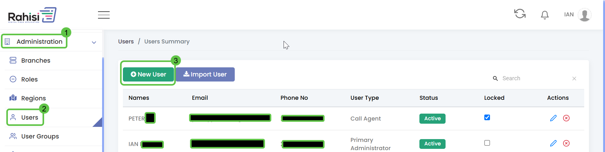

# Users

The **Users** section manages the individuals who interact with the system. These users perform different operational and administrative tasks based on their roles and responsibilities within the organization.

This feature allows the **Primary Administrator** to register users, assign them specific roles, and control access to different modules of the system

<figure><figcaption></figcaption></figure>

1. Navigate to the **Administration** Module
2. Under the **Administration** module, select **Users**
3. In the top-left corner of the Users screen, click the **"+ New User"**
4. Fill in the User Registration Form
   1. &#x20;First Name
   2. Last Name
   3. Mobile No.
   4. ID Number
   5. Email
   6. User Type
   7. Role
   8. Branch
5. Click **Save** to create the user&#x20;

### User Registration Form

<figure><figcaption></figcaption></figure>

| Property   | Description                                                         |
| ---------- | ------------------------------------------------------------------- |
| First Name | The user's given name                                               |
| Last Name  | The user's last name                                                |
| Mobile No. | The user's mobile number                                            |
| ID Number  | Users identification Number                                         |
| Email      | Users official email address                                        |
| User Type  | Indicates the general category  of the user within the organization |
| Role       | Specifies the user’s access level and permissions within the system |
| Branch     | The organizational physical location to which the user is assigned  |
