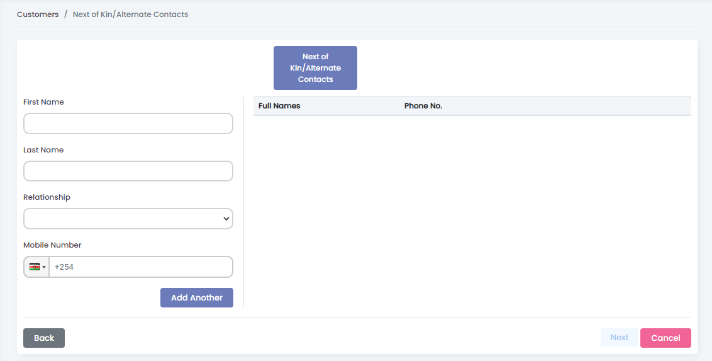

# Customer Creation

## Creating a customer


Customer creation is done on the Relationship Officer (RO) user role.


<figure><figcaption></figcaption></figure>

1. &#x20;    Go to **Registry** module.
2. &#x20;    Under registry go to **Customers.**
3. &#x20;    Click **+ New Customer** button on the top left
4. &#x20;    In Customer creation, fill the following details:&#x20;
   1. Personal Details
   2. Location Details
   3. Professional Details
   4. Next Of Kin Details
   5. Guarantor Details
   6. Branch Details
   7. Documents

### Adding Personal Details

<figure><figcaption></figcaption></figure>

| Property       | Description                                                                                                                                         |
| -------------- | --------------------------------------------------------------------------------------------------------------------------------------------------- |
| Title          | A respectful prefix used to address the customer, such as Mr., Mrs., Dr., etc.                                                                      |
| First Name     | The given name of the customer                                                                                                                      |
| Middle Name    | The middle name of the customer                                                                                                                     |
| Last Name      | The surname or family name of the customer                                                                                                          |
| Gender         | The gender of the customer,                                                                                                                         |
| Date of Birth  | The specific date on which the customer was born                                                                                                    |
| ID Type        | The specific type of identification document used to uniquely identify the customer, such as National ID, Passport, Driving License, Alien ID, etc. |
| ID Number      | The unique identifier assigned to the customer based on the selected ID type                                                                        |
| Email Address  | The electronic mail address of the customer                                                                                                         |
| Mobile No      | The mobile phone number of the customer                                                                                                             |
| Marital status | The current marital status of the customer, indicating whether they are single, married,widowed                                                     |

### &#x20;Adding Location Details

<figure><figcaption></figcaption></figure>

| Property                 | Describtion                                                                                                           |
| ------------------------ | --------------------------------------------------------------------------------------------------------------------- |
| Country                  | The nation in which the customer resides or operates                                                                  |
| County                   | A territorial division within a country, providing more localized context for the customer's residence                |
| Constituency             | A Customers electoral district within a county                                                                        |
| Ward                     |  Customers smaller administrative division within a constituency                                                      |
| Market                   | The specific market or trading center associated with the customer's residential area                                 |
| Physical Address         | The specific location where the customer resides or conducts business                                                 |
| Residence Type           | The classification of the customer's residential status, indicating whether they are an owned, family, rented, leased |
| Years Lived at Residence | The duration of time that the customer has resided at their current residential address                               |

### Adding Professional Details

<figure><figcaption></figcaption></figure>

| Property                 | Description                                                                                                |
| ------------------------ | ---------------------------------------------------------------------------------------------------------- |
| Industry Type            | The category or sector in which the business operates                                                      |
| Business Type            | The specific type of the business within the chosen industry                                               |
| Income Source            | The primary source of income for the customer either employed or business owner.                           |
| Income Range             | The range of income earned by the customer                                                                 |
| Business Description     | A brief overview or narrative describing the nature customer's business                                    |
| Business Operation Yrs   | The number of years the business has been in operation                                                     |
| Business Location Status | The current status of the business location, indicating whether it is owned, rented, leased, or temporary. |
| Business Location        | The physical address of the customers business premises                                                    |
| Business Licensed        | A binary choice indicating whether the business is licensed or not.                                        |

### Adding Next of Kin Details

<figure><figcaption></figcaption></figure>

| Property      | Description                                                          |
| ------------- | -------------------------------------------------------------------- |
| First Name    | The given name of the customer's next of kin                         |
| Last Name     | The Last name of the customer's next of kin                          |
| Relationship  | The personal relationship between the customer and their next of kin |
| Mobile Number | The mobile phone number of the customer's next of kin,               |

### Adding Guarantor Details

<figure><figcaption></figcaption></figure>

| Property      | Description                                                                                                                                          |
| ------------- | ---------------------------------------------------------------------------------------------------------------------------------------------------- |
| First Name    | guarantor given name                                                                                                                                 |
| Last Name     | guarantor last name                                                                                                                                  |
| ID Type       | The specific type of identification document used to uniquely identify the guarantor, such as National ID, Passport, Driving License, Alien ID, etc. |
| ID Number     | The unique identifier assigned to the guarantor based on the selected ID type                                                                        |
| Mobile Number | The mobile phone number of the guarantor                                                                                                             |

### Adding Branch Details

<figure><figcaption></figcaption></figure>

| Property      | Description                                                                                          |
| ------------- | ---------------------------------------------------------------------------------------------------- |
| Branch        | The specific branch within the financial institution where the customer is conducting their business |
| Loan Officer  | Relational Officer associated with creating the customer                                             |
| Scored Amount | The amount assigned by the loan officer based on the customer's creditworthiness                     |
| Loan Category | The specific category of loan that the customer is applying for within the financial institution     |

### Adding Documents

<figure><figcaption></figcaption></figure>

| Property                 | Description                                                        |
| ------------------------ | ------------------------------------------------------------------ |
| ID Front                 | Image of the front side of the customer's identification document  |
| ID Back                  | Image of the back side of the customer's identification document   |
| Passport Photo           | A recent photograph of the customer                                |
| Business Premises Photo  | A photograph depicting the customer's business premises            |
| Guarantor ID (Front)     | Image of the front side of the guarantor's identification document |
| Guarantor ID (Back)      | Image of the back side of the guarantor's identification document  |
| Guarantor Passport Photo | A recent photograph of the guarantor                               |

