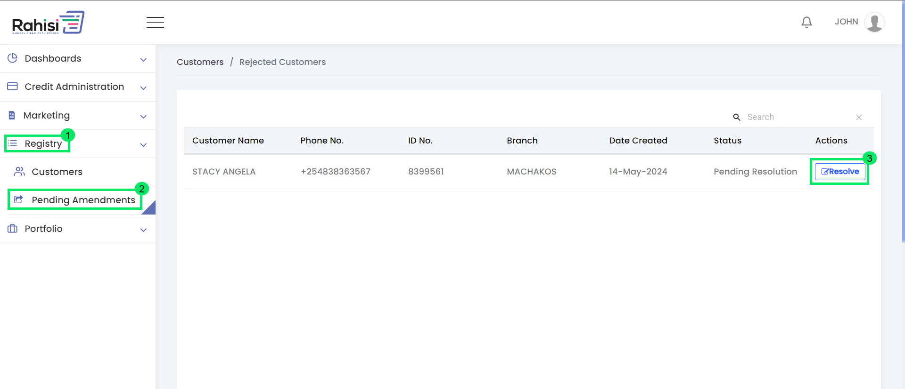

# Pending Customer Amendments


The Relationship Officer is the sole authority responsible for resolving and amending customer details.


The pending customer module displays customers who were rejected during the approval process and require amendments to address issues raised by the branch supervisor, call agent, or HQ. Once these issues are resolved, the customer re-enters the approval process to verify the updated information.

## Customer Amendment process

1. Go to **registry.**
2. Under registry go to **Pending Amendment.**
3. In the Actions column on the right, click **Resolve.**

<figure><figcaption></figcaption></figure>
