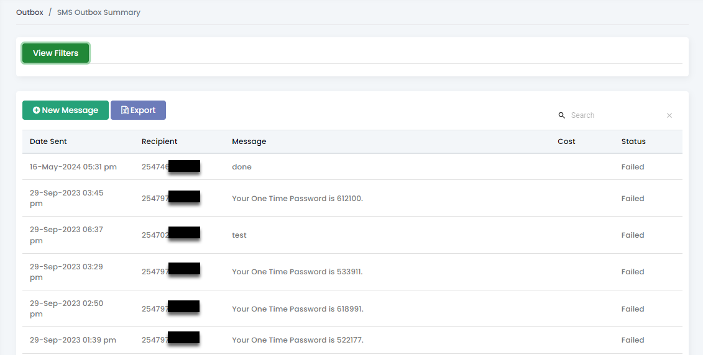

# Outbox

The Outbox allows users to monitor and manage all sent messages, providing real-time status updates on their delivery. The Outbox enables users to view a comprehensive list of all messages that have been sent through the system.

<figure><figcaption></figcaption></figure>

For each message, the Outbox displays the cost of each message and the current delivery status, indicating whether the message was successfully delivered or if it failed to reach the recipient.
